# マニュアル 3Dconnexion® SpaceMouse Enterprise（私訳版）

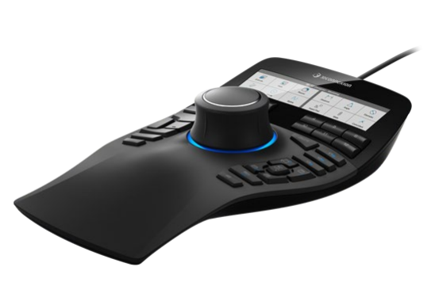

ドライバーバージョン: 3DxWare 10.8.15 以上

## クイックスタートガイド

### デスクトップ設定

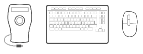

SpaceMouse Enterprise は、通常のマウスの反対側のキーボード横に置いてください。片手で 3D マウスを操作してモデルを回転・パン・ズームで配置し、もう片方の手で通常のマウスを使って選択・作成・編集を行います。

### 手の位置

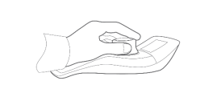

図のように手を置いてください。形状に沿ったコントローラーキャップが、正確で楽な操作に最適な指の位置へと導きます。

### インストール

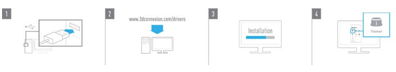

1. 接続

SpaceMouse Enterprise の USB ケーブルを PC の USB ポートに差し込みます。

2. 最新の 3Dconnexion ソフトウェアをダウンロード

最新の 3Dconnexion ソフトウェア（3DxWare）は [3dconnexion.com/drivers](https://3dconnexion.com/drivers/) で入手できます。

3. 3Dconnexion ソフトウェアをインストール

表示される手順に従って 3Dconnexion ソフトウェアをインストールします。

4. SpaceMouse Enterprise に慣れる

3Dconnexion Home を開き、トレーナーを起動して、SpaceMouse Enterprise の最初の操作をサポートしてもらいましょう。

## 機能ガイド

### 3Dconnexion SpaceMouse Enterprise

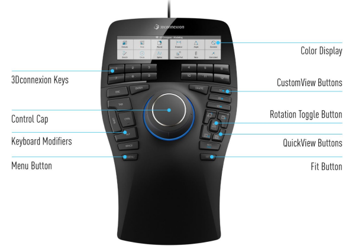

#### コントローラーキャップ（Controller Cap）

コントローラーキャップは SpaceMouse Enterprise の心臓部です。6自由度（6DoF）センサーにより、押す・引く・回す・傾ける操作で、図面や 3D モデルをパン・ズーム・回転できます。使用するアプリケーションに応じて、SpaceMouse の動作プロファイルは異なります。オブジェクトモード（Object Mode）のアプリでは、画面に手を伸ばしてオブジェクトを手に持っているような 3D ナビゲーションになります。フライモード（Fly Mode）のアプリでは、カメラを通して見ているようなナビゲーションになります。多くのアプリでは、SpaceMouse Enterprise の詳細設定でこの動作を調整できます。

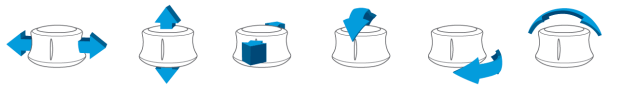

#### メニューボタン（Menu Button）

メニューボタンで 3Dconnexion デバイスを素早く簡単にカスタマイズできます。押すと 3Dconnexion 設定に直接移動します。フライアウトウィンドウで設定したいデバイスを選び、カスタマイズしてください。

#### フィットボタン（Fit Button）

フィットボタンを使えば、図面や 3D モデルを見失うことはありません。押すと図面が画面の中央に戻ります。

#### 3Dconnexion ボタン

SpaceMouse Enterprise には、コントローラーキャップとディスプレイの間に 12 個のプログラム可能なファンクションボタンがあります。使用中のアプリケーションとその環境を即座に認識し、よく使うコマンドをボタンに自動割り当てします。3Dconnexion 設定でファンクションボタンに割り当てたコマンドを個人用に変更できます。

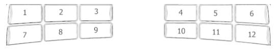

#### ディスプレイ

SpaceMouse Enterprise には、12 個の 3Dconnexion ボタンを表す 12 タイルに分かれたカラー LCD が付いています。割り当てられたコマンドを視覚的に確認できます。3Dconnexion 設定でディスプレイの輝度調整、テキストとアイコンの切り替え、LCD の文字サイズ変更が可能です。

#### オンスクリーンディスプレイ（OSD）

LCD に加え、SpaceMouse Enterprise にはオンスクリーンディスプレイ（OSD）もあります。SpaceMouse Enterprise の OSD を表示するには、3Dconnexion ボタンのいずれかを押したままにしてください。ボタンを押している間表示されます。この機能は 3Dconnexion 設定で無効にできます。

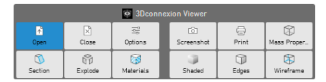

#### キーボード修飾キー（Keyboard Modifiers）

SpaceMouse Enterprise には、キーボードの対応するキーと同様に動作する 8 個のキーボード修飾キーが付いています。3Dconnexion 設定でキーボード修飾キーに割り当てたコマンドを個人用に変更できます。

#### クイックビューボタン（QuickView Buttons）

SpaceMouse Enterprise には、図面や 3D モデルを素早く目的のビューにできる 5 個のクイックビューボタンがあります。長押しで呼び出せる 2 次割り当て（青文字）があります。1 次割り当てと 2 次割り当ての両方を 3Dconnexion 設定でプログラムできます。

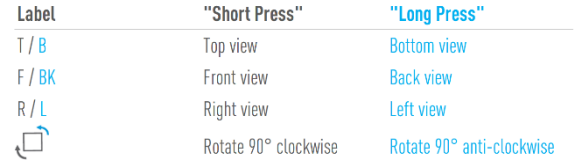

#### 回転トグルボタン（Rotation Toggle Button）

クイックビューボタン群の中央に回転トグルボタンがあります。1 回押すと全軸まわりの回転がロックされます。回転トグルが有効になったことを示すため、ステータス LED が点灯します。

#### カスタムビューボタン（CustomView Buttons）

クイックビューボタンの上に、独自のビューを保存・呼び出せる 3 個のカスタムビューボタンがあります。特定のビューを保存するには、画面に「3Dconnexion View saved」と表示されるまでカスタムビューボタンのいずれかを押し続けてください。保存したビューに戻るには、そのボタンを 1 回押すだけです。

## 3Dconnexion 設定

3Dconnexion 設定パネルには、SpaceMouse Enterprise のメニューボタン、3Dconnexion Home（デスクトップ）、通知領域（システムトレイ）のアイコン、または Windows スタートメニューからアクセスできます。
パネル上部にアクティブなアプリケーション名が表示されます。設定の変更はこのアプリケーションにのみ適用されます。

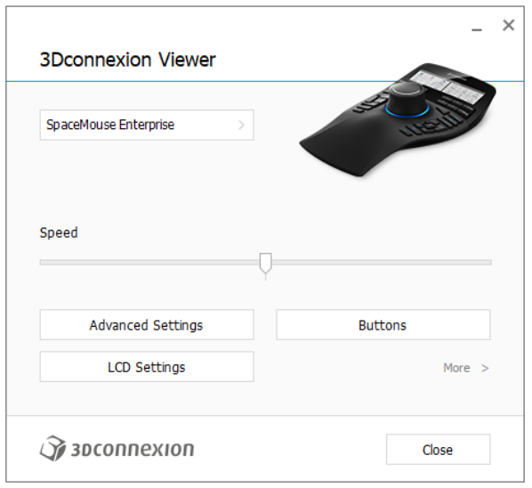

#### 速度

このスライダーでデバイス全体の速度を設定します。つまり、オブジェクト・シーン・画像を動かすために SpaceMouse キャップに加える必要がある力やトルクの量を変更します。

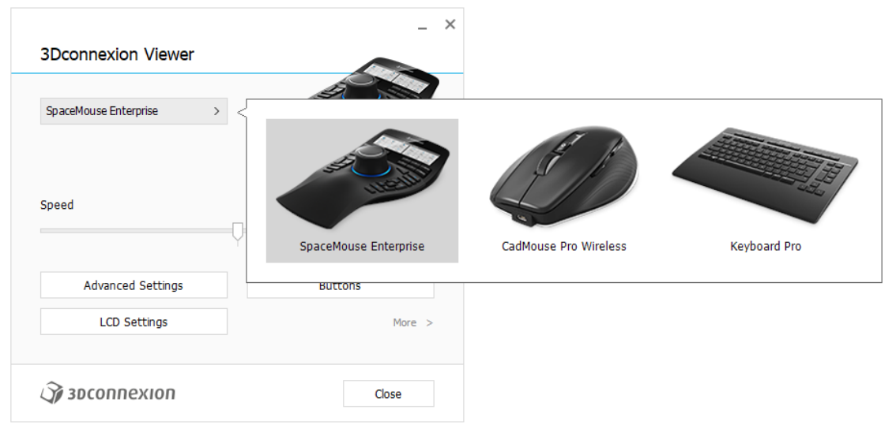

複数の 3Dconnexion デバイスが接続されている場合は、パネル左上のフライアウトボタンをクリックして、設定したい製品を選択できます。

### 詳細設定

詳細設定パネルで設定できる項目はアプリケーションごとです。そのため、各アプリで SpaceMouse の動作を好みに合わせて簡単に設定できます。

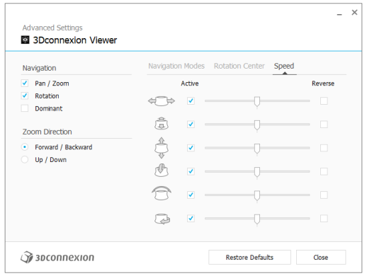

#### ナビゲーション

パン / ズーム: パーツ、アセンブリ、図面のパンを有効/無効にします。デフォルトで有効です。
回転: パーツ、アセンブリ、図面の回転を有効/無効にします。デフォルトで有効です。
ドミナント: ドミナントフィルター軸のオン/オフ。有効にするとパン、ズーム、回転が単一軸に制限されます。

#### ズーム方向

前 / 後: キャップをデスクに平行に手前へ押す、または奥へ引いてズームします。
上 / 下: キャップを画面に平行に上へ引く、または下へ押してズームします。

#### 速度

スライダーで 6 自由度の各軸の速度を個別に設定できます。動きの向きを反転するには、その動きの「反転」にチェックを入れます。

### アプリケーション別の詳細設定

一部のアプリケーションでは、SpaceMouse 用の追加設定があります。それらのアプリでは、詳細設定パネルに次のような追加オプションがあります。

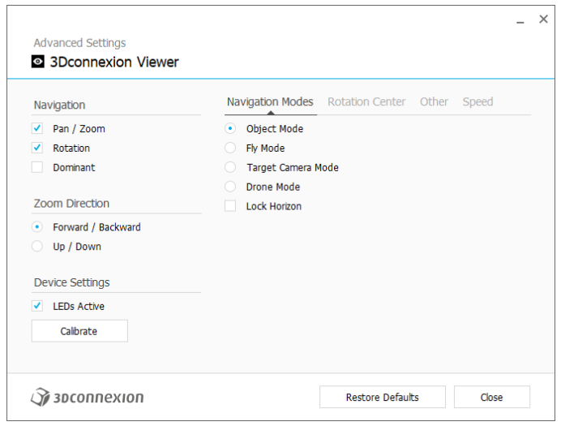

#### ナビゲーションモード

オブジェクトモード（Object Mode）: オブジェクトモードのナビゲーションを有効にします。画面に手を伸ばしてモデルを手に持っているようなモードです。SpaceMouse キャップを左に押すとモデルが左に、右に押すと右に動きます。

フライモード（Fly Mode）: コントローラーキャップをカメラのように使います。シーンに向かって押すとカメラが前に進み、左に押すとカメラが左に（シーンは右に）動きます。上に持ち上げるとカメラが上に（シーンは下に）動きます。シーンの中を飛び回るように操作している感覚です。

ターゲットカメラモード（Target Camera Mode）: ターゲットカメラモードのナビゲーションを有効にします。コントローラーキャップをターゲットカメラのように操作します。シーンに向かって押すとカメラが前に進み、左に押すとカメラが左に（シーンは右に）、上に持ち上げるとカメラが上に（シーンは下に）動きます。キャップを任意の方向に回転させると、ターゲット点を中心にオービットします（下記「回転中心」を参照）。

ドローンモード（Drone Mode）: フライモードのナビゲーションですが、下を向いた状態でキャップを前に押してもカメラの高度は変わりません。

ロックホライゾン（Lock Horizon）: 現在の水平線を維持したままにします。

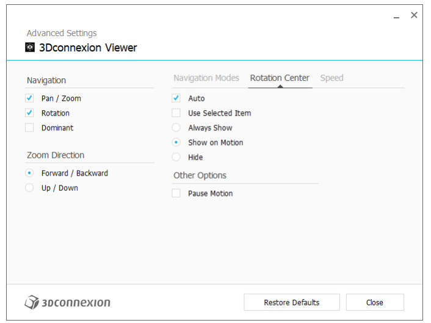

#### 回転中心（Rotation Center）

自動（Auto）: 回転の中心を動的に設定します。モデル全体が表示されているときはモデル全体の体積中心が回転点になり、近づくと視野中央付近のオブジェクトが回転中心に設定されます。

選択アイテムを使用（Use selected Item）: 回転中心を現在選択されているオブジェクトのみに限定します。

常に表示（Always Show）: 回転中心を常に表示します。

動作時に表示（Show on Motion）: 移動中のみ回転中心を表示します。

非表示（Hide）: 回転中心の表示を無効にします。

#### その他のオプション

以下のアプリケーションには特別なオプションがあります。詳細は [3Dconnexion の FAQ](https://3dconnexion.com/FAQ) をご覧ください:
Autodesk 3ds Max、Autodesk Maya、Solid Edge、SOLIDWORKS

### ボタン

3Dconnexion 設定内のボタンパネルで、コマンド・マクロ・ラジアルメニューを割り当てられます。パネル上部にアクティブなアプリケーション名が表示されます。設定の変更はこのアプリケーションにのみ適用されます。3Dconnexion ボタンを押し続けると、現在のアプリ用のボタン割り当てが OSD に表示されます。この機能を無効にするには「オンスクリーンディスプレイを無効にする」にチェックを入れます。

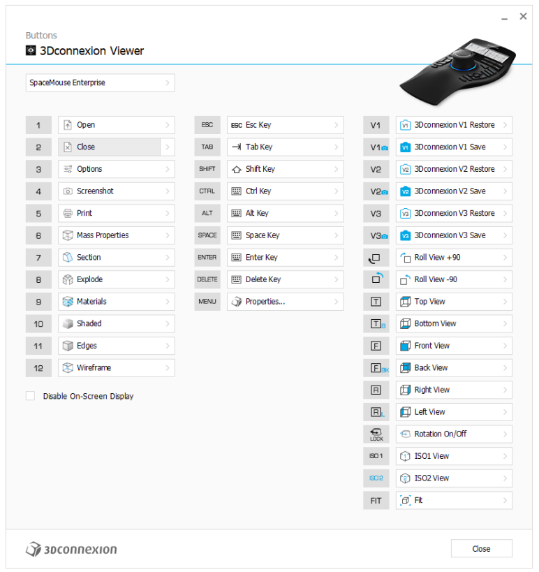

環境依存について: 一部のアプリケーションでは環境に応じたキー割り当てが可能です。そのようなアプリでは、現在アクティブな環境に応じて異なるキー割り当てを設定できます。

### ボタンへのクイックマクロの割り当て

入力欄のテキストをクリックし、必要なキーまたはキー組み合わせを押すと、キーストロークやマクロを素早く割り当てられます。

マクロを作成すると、常に押下と解放のコマンドが送信されます。押しっぱなしのコマンド（例: Ctrl や Shift）を割り当てたい場合は、フライアウトウィンドウのキーボードコマンドカテゴリを使用してください。

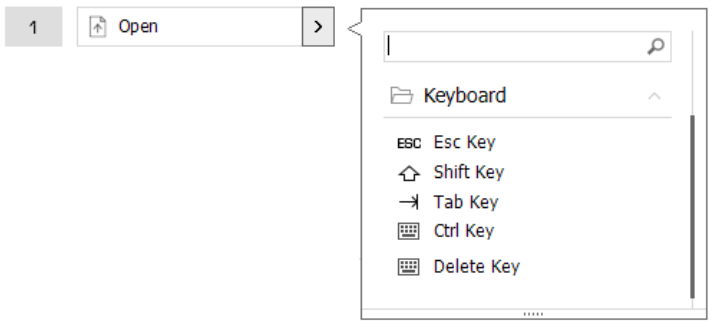

### フライアウトウィンドウを使ったコマンドの割り当て

ボタンフィールド右側の > 矢印をクリックすると、その SpaceMouse ボタン用のフライアウトウィンドウが開きます。
フライアウトウィンドウで、カテゴリ別にコマンドを閲覧または検索できます。クリックしてコマンドを選択すると、対応する SpaceMouse ボタンに自動で割り当てられます。現在割り当てられているコマンドのカテゴリは太字で表示されます。

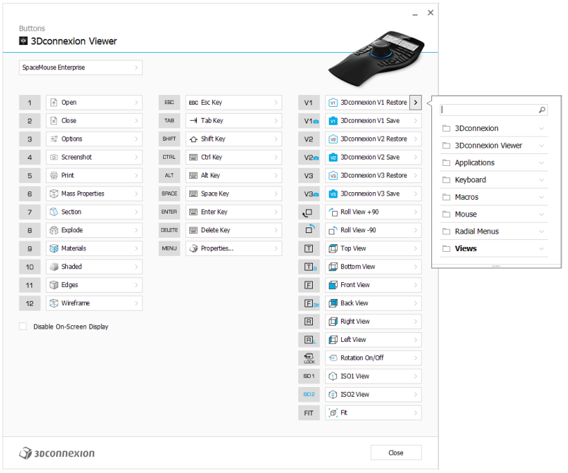

### マクロとラジアルメニューの作成

新しいマクロまたはラジアルメニューを作成するには、まずキーフィールド右側の > 矢印をクリックし、マクロ/ラジアルメニューカテゴリを展開して「新規マクロ」または「新規ラジアルメニュー」をクリックします。

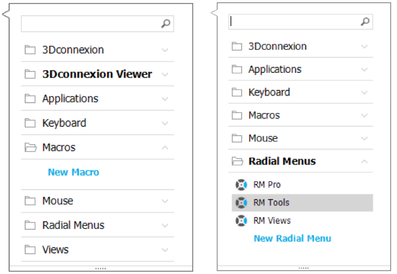

#### マクロとラジアルメニューへのアイコンの割り当て

最初のステップで、マクロまたはラジアルメニューに名前を付け、アイコンを割り当てます。
アイコンギャラリータブの既存アイコンを使うか、カスタムアイコンタブで独自のアイコンをアップロードできます。

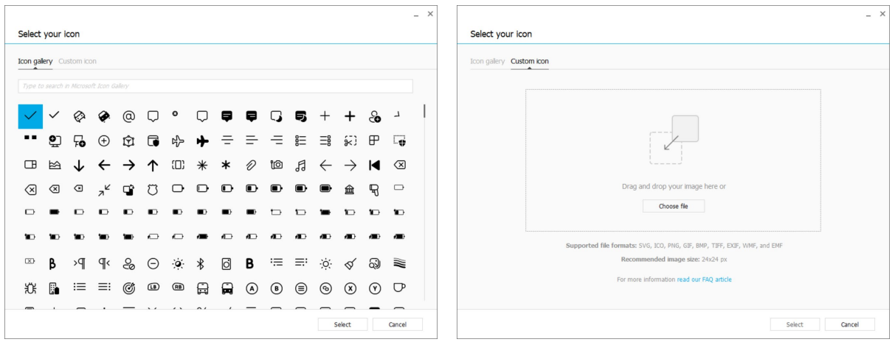

注: 画像は 500x500px 以下で、SVG、ICO、PNG、GIF、BMP、TIFF、EXIF、WMF、EMF のいずれかの形式である必要があります。表示を最適にするため、24x24px で透明背景の画像を推奨します。

#### マクロの作成

2 番目のステップで、新しいマクロを作成する際に、ステップを追加してマクロシーケンスを編集できます。

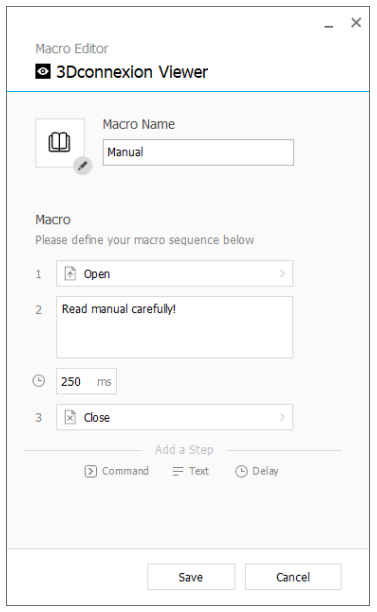

このシーケンス内で、「コマンド」ステップにキーボードショートカットを割り当てたり、フライアウトウィンドウでアプリケーションコマンドを割り当てたりできます。「テキスト」ステップでマクロにテキストブロックを追加できます。「遅延」ステップでアプリの読み込み時間が長い場合の補正ができます。
マクロのシーケンスは、ステップをドラッグして並べ替えたり、不要なステップを削除したりして編集できます。編集が終わったら保存をクリックすると、パネルを開いたボタンに新しいマクロが自動で割り当てられます。

#### ラジアルメニューの作成

新しいラジアルメニューを作成する 2 番目のステップで、4 分割または 8 分割のレイアウトを選べます。各セクションにコマンドまたはマクロを割り当ててラジアルメニューを保存します。新しいラジアルメニューは、パネルを開いたボタンに自動で割り当てられます。

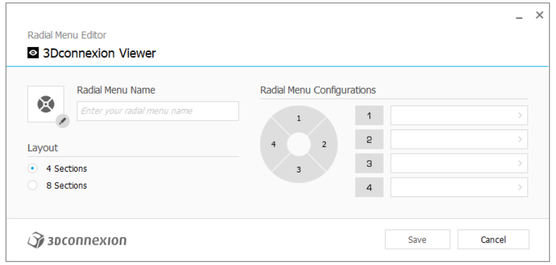

## 3Dconnexion Home

最新の 3Dconnexion ドライバーのインストールが完了すると、3Dconnexion Home から各種 3Dconnexion アプリにアクセスできます。

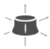

トレーナー（Trainer）:
3Dconnexion SpaceMouse の基本的な使い方を学べます。

マニュアル（Manual）:
全 3Dconnexion 製品のマニュアルを参照できます。

設定（Settings）:
3Dconnexion デバイスをカスタマイズする設定パネルを開きます。

ビューア（Viewer）:
3Dconnexion Viewer で 3D モデルを確認できます。
対応形式: .stp、.step、.igs、.iges、.obj、.stl、.ply、.jt、.glTF

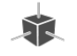

デモ（Demo）:
航空機の着陸装置を組み立てて、操作の練習ができます。

登録（Registration）:
インストール後に製品を[登録](https://3dconnexion.com/product-registration/login/)すると、3Dconnexion のサービスを利用できます。

ビデオ（Videos）:
3Dconnexion デバイス向けの説明[動画](https://3dconnexion.com/ext-media/3dxhome/trainingvideos/)を視聴できます。

フィードバック（Feedback）:
3Dconnexion 製品チームに[フィードバック](https://forms.office.com/pages/responsepage.aspx?id=6D6W52Acf0uhoFh_dK3cFi8BFVt4p0pKtG979iuSs6tUMDY0STNBV01GU1lBU0Q1TzJCNzEwRlZVUC4u)を送信できます。

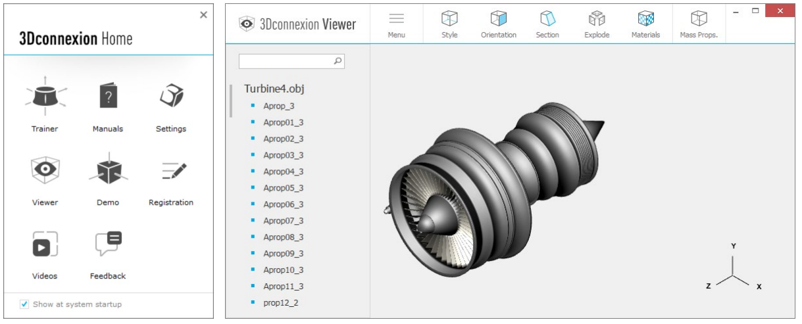

## 技術仕様

### 寸法・重量

長さ: 249 mm / 9.8"  
幅: 154 mm / 6.1"  
高さ: 58 mm / 2.3"  
重量: 800 g / 1.76 lb / 28.22 oz  

### 対応オペレーティングシステム

Microsoft Windows、macOS  
[詳細](https://3dconnexion.com/supported-operating-systems/)

### 同梱品

3Dconnexion SpaceMouse Enterprise

### パーツ番号

包装単位番号: 3DX-700056  
パーツ番号: 3DX-600051

## 安全、適合性および保証について

### 製造元

3Dconnexion GmbH  
Clarita-Bernhard-Straße 18  
81249 Munich  
Germany

### 認証・登録

CE、UKCA、EAC、FCC、KC、RCM、BSMI、WEEE、RoHS-EU、RoHS-CN  
[詳細](https://3dconnexion.com/compliance/)

### 保証

ハードウェア限定保証 3+1 年  
（製品登録で 1 年延長）

### サポート

[3dconnexion.com/support](https://3dconnexion.com/support/)

---

https://3dconnexion.com/manuals/spacemouse-enterprise/en/Manual_3Dconnexion-SpaceMouse-Enterprise_EN.pdf の私訳版です。(2026-03-19)
